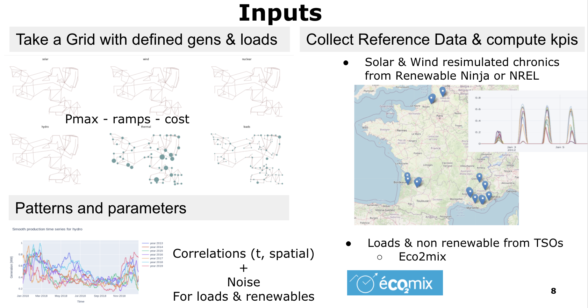
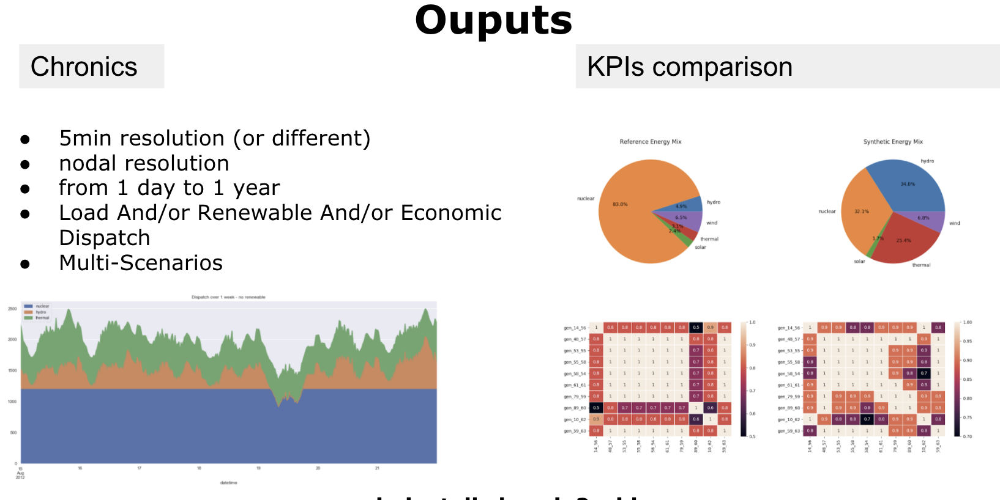
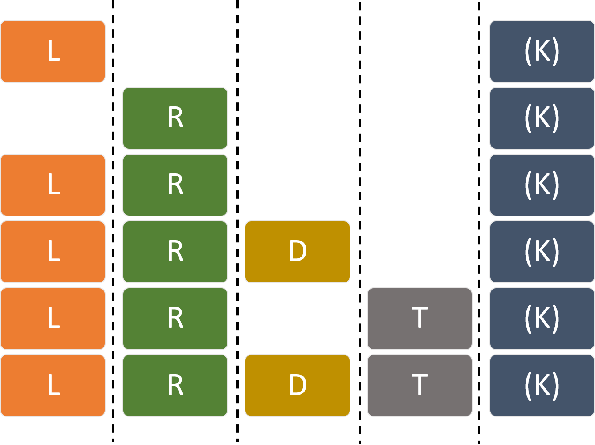

# ChroniX2Grid - The Extensive PowerGrid Time-serie Generator

Chronix2Grid is a python package, providing a command-line application as well, 
that allows to generate synthetic but realistic consumption, renewable production, electricity loss (dissipation) 
and economic dispatched productions chronics given a power grid.
Reference data that you provide will serve to calibrate the parameters 
so that the synthetic data reproduce some realistic criteria (KPIs) from the reference data.

*   [1 Chronix2Grid at a glance](#glance)
*   [2 Installation](#installation)
*   [3 Getting Started](#getting-started)
*   [4 The command-line interface](#the-command-line-interface)
*   [5 Configuration](#configuration)
*   [6 Running the test suite](#running-the-test-suite)

See the documentation at https://chronix2grid.readthedocs.io/en/latest/

## Chronix2Grid at a glance
 

 

## Installation

### Requirements:
*   Python >= 3.6

#### (Optional, recommended) Step 1: Create a virtual environment
```commandline
pip3 install -U virtualenv
python3 -m virtualenv venv_chronix2grid
```

#### Step 2 (first option): Install from pypi
```commandline
source venv_chronix2grid/bin/activate
pip install Chronix2Grid
```

#### Step 2 (second option): Install from source
```commandline
source venv_chronix2grid/bin/activate
git clone https://github.com/mjothy/ChroniX2Grid.git
cd ChroniX2Grid/
pip install -U .
```

### Additional install required for dispatch

A backend for dispatch has been implemented with PyPSA 

 ```commandline
pip install pypsa==0.17.0
```
You might need to install cbc solver as well that pypsa will call: https://projects.coin-or.org/Cbc

## Getting Started
Four notebooks are provided to get you started with this package:

* **getting_started_cli.ipynb** guide you through the use of chronix2grid cli
* **getting_started_api.ipynb** is a more detailed notebook that presents chronix2grid api and showcases several ways to
 analyze the chronics produced
* **running_chronics_grid2op.ipynb** is a notebook giving an example of how generated chronics can further be used to create power grid scenarios and run them 
 analyze the chronics produced
* **RenewableNinja_Solar_WInd_KPI_format.ipynb** is an example on how to retrieve Solar and Wind reference chronics from the
  [renewable ninja](https://www.renewables.ninja/) api. There will be use to compare the KPI's with the generated chronics. 
 
Additionally, a data starting kit is provided to run an example in the folder 
  ```commandline
getting_started/example
```
 The output folder corresponds to the following run of chronix2grid : 
 ```commandline
chronix2grid --mode LRTK --ignore-warnings --weeks 8 --n_scenarios 1 --start-date 2012-01-01 --by-n-weeks 4
```

NB:
* Default input data from package will be used if no --input-data and --case is provided
* Output will be written in the working directory in a folder output/

To provide --input-data and --output-folder folders and specify --case grid case, you would run this kind of command (make sure to change ChroniX2Grid_path with you own path) : 
 ```commandline
chronix2grid --mode RLTK --output-folder ChroniX2Grid_path/getting_started/example/output --input-folder ChroniX2Grid_path/getting_started/example/input --ignore-warnings --weeks 8 --case case118_l2rpn_wcci --n_scenarios 1 --start-date 2012-01-01 --by-n-weeks 4
```

### WARNING
In order to limit the size of the output and the running time for this example, chronics are only generated for 8 weeks.
This implicates that some kpis that defined on a whole year will not be exploitable for this example.
 
## The command-line interface
```commandline
Usage: chronix2grid [OPTIONS]

Options:
  --case TEXT               case folder to base generation on
  --start-date TEXT         Start date to generate chronics
  --weeks INTEGER           Number of weeks to generate
  --by-n-weeks INTEGER      Size of the output chunks in weeks
  --n_scenarios INTEGER     Number of scenarios to generate
  --mode TEXT               Steps to execute : L(K) for loads only (and KPI);
                            R(K) for renewables (and KPI) only; LRT (K) 
                            for load, renewable and thermic generation (and KPI); 
                            LRDT(TK) for load, renewable, loss (dissipation) generation 
                            (and thermic and KPI)   

  --input-folder TEXT       Directory to read input files from.
  --output-folder TEXT      Directory to store output files.
  --seed-for-loads TEXT     Input seed to ensure reproducibility of loads
                            generation

  --seed-for-res TEXT       Input seed to ensure reproducibility of renewables
                            generation

  --seed-for-dispatch TEXT  Input seed to ensure reproducibility of dispatch
  --ignore-warnings         Ignore the warnings related to the existence of
                            data files in the chosen output directory.

  --scenario_name TEXT      subname to add to the generated scenario output
                            folder, as Scenario_subname_i

  --nb_core INTEGER         number of cores to parallelize the number of
                            scenarios

  --help                    Show this message and exit.

```

## Launch mode
4 generation submodules and a KPI module are available

* L - load generation
* R - wind and solar production generation
* D - loss generation a priori, that will be used for dispatch and potentially corrected afterwards
* T - thermic and hydro production generation thanks to an economic dispatch (simplified optimal power flow simulation)
* K - KPI generation in order to compare synthetic (generated) chronics to reference (real-life) chronics

The figure below shows how these submodules can be launched together with --mode/-m argument. 
Note that D and T submodules can't be launched without previous L and R modules, and that KPIs can always been computed 

 

## Configuration

### Chronic generation detailed configuration
Detailed configuration is made through thematic json files. 
For instance you will use in the current implementation of Chronix2grid:

* **params.json** for general generation configuration (generation timestep, noise for forecast chronics)
* **params_load.json** for load generation
* **params_res.json** for solar and wind generation. You will use paramsGAN.json in case you are using the backend with Generative Adversarial Networks
* **params_loss.json** for a priori loss generation
* **params_opf.json** for dispatch and a posteriori loss simulation

Below is an example of **params.json** which will launch a 5 minutes time step generation, 
applying a gaussian noise to forecast chronics with a standard deviation of 0.01
```json
{
  "dt": 5,
  "planned_std": "0.01"
}
```

Below is an example of **params_load.json** that provides parameters to correlated generation algorithm.

```json
{
  "Lx": 1000,
  "Ly": 1000,
  "dx_corr": 250,
  "dy_corr": 250,
  "temperature_corr": 400,
  "std_temperature_noise": 0.06
}
```

You'll find all the details on the parameters used in these json files in the [documentation about implemented models](https://chronix2grid.readthedocs.io/en/latest/DESCRIPTION.html)

### KPI configuration
Some general parameters have to be set in *INPUT_FOLDER/kpi/paramsKPI.json*
- **comparison**: name of benchmark folder to use for KPI reference chronics. For example, benchmark *France* has been implemented with eco2mix and renewable ninja data
- **timestep**: timestep for KPI computation. For example, renewable ninja data requires minimum timestep of 60min
- **night_hours**: dictionary to provide night hours for each season of year
- **seasons**: dictionary to provide months in each season of year

## Model interface

All generation submodules (LRDT) have a modular backend. 
You can develop your own load, renewable, loss and dispatch model using as input: 
* Your json parameters
* Possible pattern files, or trained neural networks
* Grid demand and generator characteristics in csv

## Citing
```
@misc{chronix2grid,
    author = {A. Marot, N. Megel, V. Renault, M. Jothy },
    title = {{ChroniX2Grid - The Extensive PowerGrid Time-serie Generator}},
    year = {2020},
    publisher = {GitHub},
    journal = {GitHub repository},
    howpublished = {\url{https://github.com/BDonnot/ChroniX2Grid}},
    }
```
## Running the test suite

To launch the unit test suite:
```commandline
pipenv run python -m pytest tests/unit_tests/ [--verbose -p no:warnings]
```

To launch integration tests:
```commandline
pipenv run python -m pytest tests/integration_tests/ [--verbose -p no:warnings]
```

To launch the Command Line Interface (CLI) test (only if you installed chronix2grid package from Pypi)
```commandline
pipenv run python -m pytest tests/cli_tests/
```

You can also analyse the coverage of the tests with coverage and generate an html report:
```commandline
pip install coverage
coverage run --source=./chronix2grid -m unittest discover
coverage html
```
This will generate a htmlcov folder containing a static web site with the analysis. Open index.html in a browser
 to analyse it.
