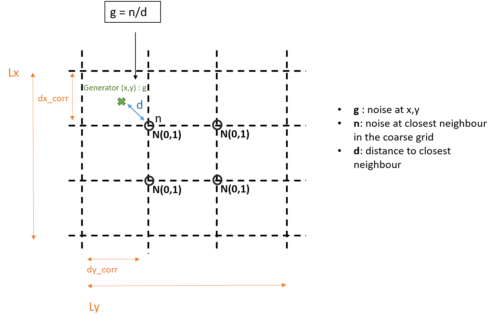
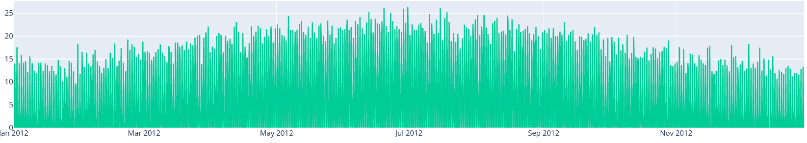
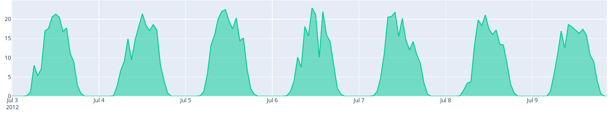
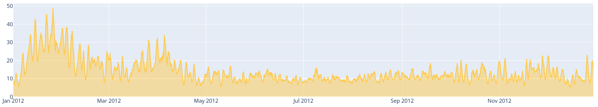
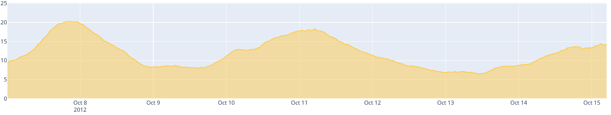
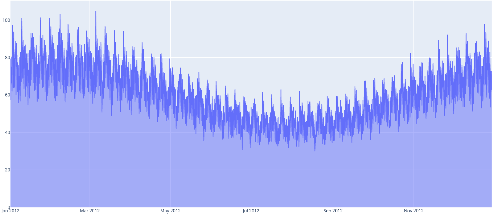
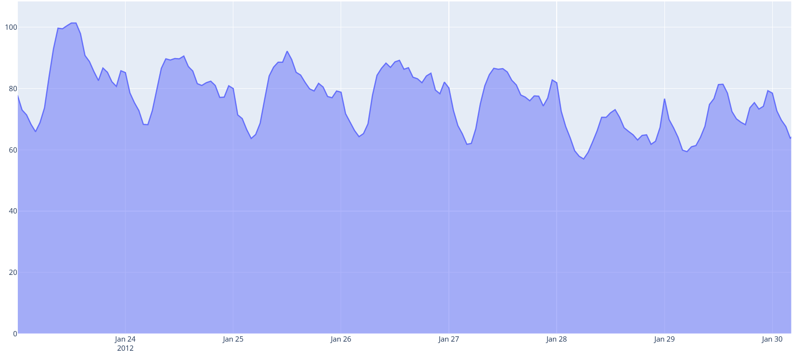
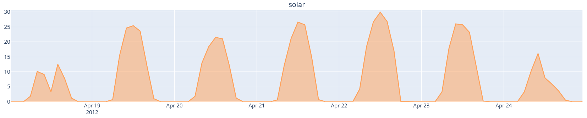
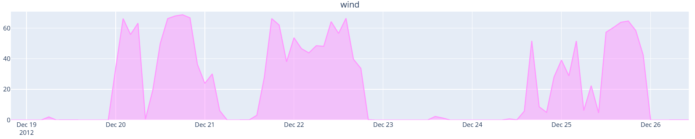

.. _implemented-models:

*********************************
Description of implemented models
*********************************

Introduction
============

Some generation models are already implemented within chronix2grid as examples for other model implementation.
This chapter describes the methods they include and how to set their configuration

.. _correlated-noise:

General inputs
===============

In *params.json* there are some settings concerning the whole generation process

* **dt** the time resolution of the final chronics that will be modeled.
* **planned_std** standard deviation of noise for the forecasted chronics (e.g. *load_p_forecasted.csv.bz2* which correspond to non-exact planned chronics.

Pattern-based methods with spatio-temporal correlated noise
================================================================

Generation of correlated noise
^^^^^^^^^^^^^^^^^^^^^^^^^^^^^^^^^
In load, solar and wind current modelling, some spatial and temporal correlated noises are generated.
These functions  are written :math:`f_t^\text{category}(x,y)`, :math:`category` being the model category (solar, short medium or long term for wind, temperature for load).
They are based on:

* A coarse 3-dimensional mesh (x,y,t) with independent noise
* The spatial and temporal interpolation of this noise at the specific location of generators and specific moments of time

In *params_res.json* and *params_load.json* you can find all the required parameter for this correlated noise generation, which can be set separately between load and renewable production generation:

* **Lx**, **Ly** the total length of the mesh
* **dx_corr**, **dy_corr** the granularity of the coarse mesh. it represents the distance at which we consider that spatial phenomenons are independent
* **solar_corr**, **short_wind_corr**, **medium_wind_corr**, **long_wind_corr** and **temperature_corr** which define the coarse time resolution for each type of noise

Spatial correlation
""""""""""""""""""""""""

For each coarse time step t, a 2-dimensional coarse mesh is built.
At each node (x,y,t) an independent random gaussian noise :math:`N(0,1)` is computed

Then a spatial interpolation is made at the specific location (x,y) of the generator,
weighted by the distance ot its nearest neighbour in the mesh

Temporal correlation
""""""""""""""""""""""""

Then a temporal auto-correlation structure is achieved. For each category, we go from
resolution **[category]_corr** (at which noises have been generated independently in time)
to resolution **dt** thanks to spline interpolation

Solar generation
^^^^^^^^^^^^^^^^^^

For solar generation, some additional parameters are provided:

* A yearly smooth solar pattern file at .npy format. It will be marked as :math:`pattern_t` and it doesn't depend on x and y
* In *params_res.json*:
    * **solar_corr** - resolution of temporal autocorrelation in noise (see :ref:`correlated-noise`)
    * **std_solar_noise** - standard deviation of the spatial and temporal correlated noise. It will be marked as :math:`\sigma`
    * **smooth_dist** - standard deviation of additional centered gaussian noise (will be normalized by Pmax). It will be marked as :math:`s`

For each solar generator located at x, y and with max power generation of :math:`P_\text{max}`

.. math:: prod_t(x,y) = P_\text{max} * smooth(pattern_t * (0.75+\sigma f_t^\text{solar}(x,y)) + n_s(x,y,t,P_\text{max}))

Where :

* :math:`f_t^\text{solar}(x,y)` is the solar correlated noise (see section :ref:`correlated-noise`)
* smooth is a smoothing function. We currently use :math:`smooth(x) = 1 - exp(-x)`. It has the property to normalize data between 0 and 1, but also to operate a convex transformation of the distribution which better fits realistic data.
* :math:`n_s(x,y,t,P_\text{max})` is an independent additional noise following distribution :math:`N(0,s/P_\text{max})`
* 0.75 is the bias of the spatially and temporally correlated noise.

In other words, the yearly temporal pattern is multiplied by a biased noise function which defines the spatial and temporal correlation structures
of solar generators. It implies by the way that zero production timesteps remain zero.
Then a centered and independent gaussian noise is added to each generator. This quantity is smoothed and scaled in
interval :math:`[0,1]`. Finally, this normal production is rescaled to :math:`P_\text{max}`

   Example of generated solar chronic across year 2012. Pmax of the solar farm is 37.3 MW. :math:`solar_\text{corr} = 20 minutes` - :math:`smooth_\text{dist} = 0.001` - :math:`\sigma = 0.4`

   Focus on one week in summer

Wind generation
^^^^^^^^^^^^^^^^^

The wind normal seasonal pattern relies on a simple cosine which oscillation period is one full year.
Its constant component has a part of 70% and the oscillating component accounts for 30%.
It is at its highest value during December and its lowest value during June. It is simulated as follows:

.. math:: pattern_t = 0.7 + 0.3 cos({2\pi(t-\delta t) \over 365*24*60})

* :math:`t` is the cumulated simulation time in minutes
* :math:`\delta t` is the time delta in minutes between our first simulation time step and the 02/12/2017

For wind generation, some additional parameters are provided.
Note that wind correlated noise structure is achieved with 3 components corresponding to short, medium and long time scales.
It is in *params_res.json*:

* **short_wind_corr**, **medium_wind_corr** and **long_wind_corr** - resolutions of temporal auto-correlations in noises (see :ref:`correlated-noise`). The higher the time scale the longest is the dependency in the auto-correlation structure
* **std_short_wind_noise**, **std_medium_wind_noise** and **std_long_wind_noise** - standard deviation of the spatial and temporal correlated noise. It will be marked as :math:`\sigma_\text{category}`
* **smooth_dist** - standard deviation of additional centered gaussian noise (will be normalized by Pmax). It will be marked as :math:`s`

Finally, for a given generator located at coordinates :math:`(x,y)`, the shape of the simulated chronics follow the equation:

.. math:: prod_t(x,y) = P_\text{max} smooth(0.1 * exp(4 * pattern_t * (0.3 + \sigma_\text{medium_wind} f_t^\text{medium_wind}(x,y)

    + \sigma_\text{long_wind} f_t^\text{long_wind}(x,y)

    )

    + \sigma_\text{short_wind} f_t^\text{short_wind}(x,y)

    )

    + n_s(x,y,t,P_\text{max}))

Where:

* :math:`f_t^\text{wind_category}(x,y)` are the wind correlated noises (see section :ref:`correlated-noise`)
* smooth is a smoothing function. We currently use :math:`smooth(x) = 1 - exp(-x)`. It has the property to normalize data between 0 and 1, but also to operate a convex transformation of the distribution which better fits realistic data.
* :math:`n_s(x,y,t,P_\text{max})` is an independent additional noise following distribution :math:`N(0,s/P_\text{max})`

   Example of generated wind chronic across year 2012. Pmax of the wind farm is 67.2 MW. :math:`wind_\text{corr} = 300 min, 1440 min, 20160 min` - :math:`smooth_\text{dist} = 0.001` - :math:`\sigma = 0.02, 0.15, 0.15`

   Focus on one week in fall

Load generation
^^^^^^^^^^^^^^^^

For load generation, parameters are similar to solar generation

* A weekly consumption pattern file at .csv format. It will be marked as :math:`weeklypattern_t` and it doesn't depend on x and y
* In *params_load.json*:
    * **temperature_corr** - resolution of temporal auto-correlation in noise (see :ref:`correlated-noise`)
    * **std_temperature_noise** - standard deviation of the spatial and temporal correlated noise. It will be marked as :math:`\sigma`

Additionally to the weekly pattern, a seasonal pattern is modeled with a cosine which oscillation period is one full year.
Its constant component has a part of 5.5/7 and the oscillating component accounts for 1.5/7.
It is at its highest value during December and its lowest value during June. It is simulated as follows:

.. math:: seasonalpattern_t = {5.5 \over 7} + {1.5 \over 7} * cos({2\pi(t-\delta t) \over 365*24*60})

* :math:`t` is the cumulated simulation time in minutes
* :math:`\delta t` is the time delta in minutes between our first simulation time step and the 02/12 of the year before simulation

Finally, for each load site located at x, y and with max power consumption of :math:`P_\text{max}`

.. math:: load_t(x,y) = P_\text{max} * weeklypattern_t * (\sigma * f_t^\text{temperature}(x,y) + seasonalpattern_t)

Where :math:`f_t^\text{temperature}(x,y)` is the temperature correlated noise (see section :ref:`correlated-noise`)

   Example of generated load chronic across year 2012 in region R3. Pmax of the load is 77.1 MW. :math:`temperature_\text{corr} = 400 min` - :math:`\sigma = 0.06`

   Focus on one week in winter

Loss generation
^^^^^^^^^^^^^^^^

A simple module is actually implemented.
It reads a csv containing a yearly loss pattern chronic (5 min time step in the example provided), given as an absolute power value in MW.
Two inputs are necessary, with example provided in *getting_started/example/input*:

* A csv file containing the yearly loss pattern  in *patterns/loss_pattern.csv*
* A json parameter file that indicates the path to loss pattern in *case118_l2rpn_wcci/generation/params_loss.json*

Methods based on Generative Adversarial Networks (GAN)
=======================================================

Realistic chronics can be generated thanks to GAN trained on a wide chronics history.

It has been implemented for solar and wind generation in *Chronix2Grid* via an optional backend :class:`chronix2grid.generation.renewable.RenewableBackend.RenewableBackendGAN`

*RenewableBackendGAN* handles previously trained neural networks that rely on *tensorflow*. These networks can be trained apart from chronix2grid with the source code on a
`public github repository <https://github.com/chennnnnyize/Renewables_Scenario_Gen_GAN>`_ that reproduces the results of a `research paper <https://arxiv.org/abs/1707.09676>`_.
You will also have to serialize them thanks to *tensorflow.train.Saver* objects
(see `this tutorial <https://cv-tricks.com/tensorflow-tutorial/save-restore-tensorflow-models-quick-complete-tutorial/>`_)

Configuration
^^^^^^^^^^^^^^^^

A json parameters and some *tensorflow* models are required. An example is available in *input_data/generation/case118_l2rpn_neurips_1x_GAN*.
Inputs should be provided in the following structure:

* neural_network/
    * paramsGAN.json
    * solar/
        * name_solar_model.data-00000-of-00001
        * name_solar_model.meta
        * name_solar_model.index
        * checkpoint
    * wind/
        * name_wind_model.data-00000-of-00001
        * name_wind_model.meta
        * name_wind_model.index
        * checkpoint

File *paramsGAN.json* enables to indicate the shape of inputs in the underlying model used in training.

Each has a suffix (*_wind* or *_solar*) corresponding to the 2 separated networks.

    * *model_name*
    * *batch_size*, *n_gens*, *n_timestep* - The 3 dimensions of each training batch - batch_size x number of generators in training - number of modeled consecutive timesteps
    * *n_events* - number of events labels used in training
    * *dim_inputs*, *mu*, *sigma* - size of gaussian input vector, mean and standard deviation

Generation process
^^^^^^^^^^^^^^^^^^^^

According to the *Chronixgrid* chosen time horizon, the backend reads the trains networks and generates as many independent prediction batches as necessary.
To perform this, it generates as many random inputs (gaussian noise and event labels).
Then it picks as many generators chronics as needed in the grid. An error is returned if there is not enough generators returned by the network.

   Generated solar production - 1-week example on one generator

   Generated wind production - 1-week example on one generator

.. warning::
    The current trained network have been taken directly with the configuration of the paper with no additional tuning.

    That implies in particular that GAN generation is only compatible with 2 hour time steps

    The 2-days batch imply that no seasonality across year is taken into account.
    It could be the case by changing the training tuning in two possible ways

        * Growing the size of timesteps in one batch
        * Using event labels to model apropriate seasons

Economic dispatch generation (hydro, nuclear and thermic generators)
====================================================================

In the economic dispatch step, an Optimal Power Flow (OPF) is computed on the grid.
This is achieved thanks to `PyPSA package <https://pypsa.readthedocs.io/en/latest/>`_ which enable to have an object representation of the grid and an API to solve OPF.
Inputs for the dispatch step are the following:

* In *patterns/hydro_french.csv*: a hydro guide curve pattern that represents the seasonality of the minimum and maximum hydraulic stocks
* In *case/params_opf.json*
    * **step_opf_min** - time resolution of the OPF in minutes. It can be 5, 10, 15, 20, 30 or multiples of 60 and has to be superior or equal to dt (generation time resolution). In case it is strictly above, interpolation is done after dispatch resolution
    * **mode_opf** - frequency at which we wan't to solve the OPF
    * **dispatch_by_carrier** - if True, dispatch results will be returned for the whole carrier. If False, it will be returned by generator
    * **ramp_mode** is essentially designed for debug purpose: when your OPF diverges, you may want to relax some constraints to know the reasons why the problem is unfeasible or leads to divergence
        * If *hard*, all the ramp constraints will be taken into account.
        * If *medium*, thermal ramp-constraints are skipped
        * If *easy*, thermal and hydro ramp-constraints are skipped
        * If *none*, thermal, hydro and nuclear ramp-constraints are skipped
    * **reactive_comp** - Factor applied to consumption to compensate reactive part not modelled by linear opf
    * **pyomo** - whether pypsa should use pyomo or not (boolean)
    * **solver_name** - name of solver, that you should have installed in your environment and added in your environment variables.
    * **losses_pct** - if D mode is deactivate, losses are estimated as a percentage of load.
    * **hydro_ramp_reduction_factor** - optional factor which will divide max ramp up and down to all hydro generators

The object *chronix2grid.generation.dispatch.EconomicDispatch:Dispatch* facilitates the configuration of the optimization problem with PyPSA.
We currently solve a simplified OPF that optimizes costs with respect towards the following constraints:

* Match the net load - i.e. load minus solar and wind prod plus total loss
* Features of each generator: Pmin, Pmax, Ramps up and down (min et max)
* Hydro production should not go out of the hydro pattern guide curves

Correction a posterori with simulated loss
=============================================

After computing the solution of the dispatch, it is possible to use a simulator of the grid to compute realistic loss
a posteriori, on the basis og these chronics. We use grid2op to achieve this simulation.

It is optional and set in *case/params_opf.json*

* **loss_grid2op_simulation** - boolean to specify if we wan't to compute the simulation. If not provided, the user is warned that we assume it is False.
* **idxSlack** and **genSlack** - id and name of the slack generator, on which the loss will be deduced from the production by convention
* **early_stopping_mode** - after the simulation, the modification of the slack generator production can lead to violation of one or several constraints on this generator (Pmax, Pmin, max and min ramp-up, max and min ramp_down). If early_stopping_mode is true, an error is returned and the generation is aborted. If false, a warning that quantifies the violation is returned.
* **pmin_margin**, **pmax_margin**, **rampup_margin**, **rampdown_margin** - deltas in MW that are allowed for the constraints on slack generator before triggering warning or error for violation
* **agent_type** - represents the type of `grid2op agent <https://grid2op.readthedocs.io/en/latest/agent.html>`_. Can be reco for RecoPowerLineAgent or do-nothing for DoNothingAgent. Currently, there is only the DoNothingAgent handled

At the end of this step, the files *prod_p.csv.bz2* *prod_p_forecasted.csv.bz2* are edited to modify the slack generator production chronic.

.. note::
    If no *loss_grid2op_simulation* is provided, chronix2grid follows considering it is False

