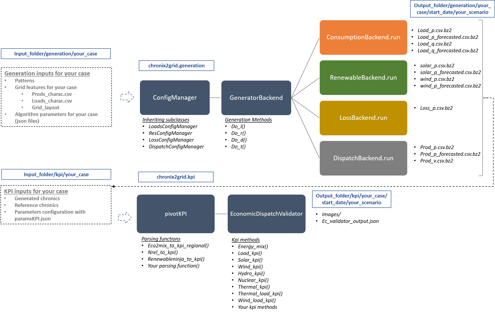
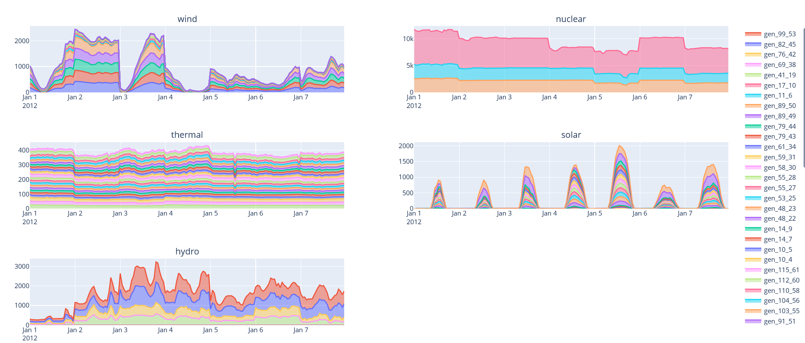

***************
Getting Started
***************

Launch Chronix2Grid
====================

``chronix2grid [OPTIONS]``

--case string
                            Case folder to base generation on
--start-date string
                            Start date to generate chronics
--weeks int           Number of weeks to generate
--by-n-weeks int      Size of the output chunks in weeks
--n_scenarios int     Number of scenarios to generate
--mode string
                            Steps to execute : L(K) for loads only (and KPI);
                            R(K) for renewables (and KPI) only; LRT (K)
                            for load, renewable and thermic generation (and KPI);
                            LRDT(TK) for load, renewable, loss (dissipation) generation
                            (and thermic and KPI)

--input-folder string
                            Directory to read input files from.
--output-folder string
                            Directory to store output files.
--seed-for-loads string
                            Input seed to ensure reproducibility of load generation
--seed-for-res string
                            Input seed to ensure reproducibility of renewables generation
--seed-for-dispatch string
                            Input seed to ensure reproducibility of dispatch
--ignore-warnings
                            Ignore the warnings related to the existence of
                            data files in the chosen output directory.
--scenario_name string
                            Subname to add to the generated scenario output folder, as Scenario_subname_i
--nb_core int
                            Number of cores to parallelize the number of scenarios

Features
============

4 generation submodules and a KPI module are available

* L - load generation
* R - wind and solar production generation
* D - loss generation (depending on L and R)
* T - thermic production generation thanks to a production dispatch (simplified optimal power flow computation)
* K - KPI generation in order to compare synthetic (generated) chronics to reference (real-life) chronics

The figure below shows how these submodules can be launched together with --mode argument.
Note that D and T submodules can't be launched without previous L and R modules, and that KPIs can always been computed

.. image:: ../pictures/Launch_mode.png

Workflow and model interface
=============================

The global workflow of chronix2grid is illustrated below, and shows the API used to operate each step of the process.

.. note::
   All the class, methods and functions described in the image above are designed to be edited with your own generation models. See :ref:`model-interface`.

Didactic examples
==================================

Four notebooks are provided to get you started with this package:

* **getting_started_cli.ipynb** guide you through the use of chronix2grid cli
* **getting_started_api.ipynb** is a more detailed notebook that presents chronix2grid api and showcases several ways to
 analyze the chronics produced
* **running_chronics_grid2op.ipynb** is a notebook giving an example of how generated chronics can further be used to create power grid scenarios and run them
 analyze the chronics produced
* **RenewableNinja_Solar_WInd_KPI_format.ipynb** is an example on how to retrieve Solar and Wind reference chronics from the
  [renewable ninja](https://www.renewables.ninja/) api. There will be use to compare the KPI's with the generated chronics.

Additionally, a data starting kit is provided to run an example in the folder ``getting_started/example``

The output folder corresponds to the following run of chronix2grid :

``chronix2grid --mode RLTK --output-folder ChroniX2Grid/getting_started/example/output --input-folder /ChroniX2Grid/getting_started/example/input --ignore-warnings --weeks 8 --case case118_l2rpn_wcci --n_scenarios 1 --start-date 2012-01-01 --by-n-weeks 4``

The generated production chronics by carrier on 4 weeks of january 2012 can be represented as below.
This visualization is available in interactive HTML format in *output/kpi/case/scenario/images/dispatch_view/*

Inputs and Configuration
========================

For synthetic chronic generation, one should provide

* Data that represents grid, demand and generators characteristics. See *getting_started/example/input/* for example.
* Pattern data (ex: weekly load profile)
* Json parameters for generation algorithms

One should also provide reference chronics data for comparison through a library of KPIs

.. image:: ../pictures/ChroniX2Grid_inputs.png

Outputs
========================

The outputs are serialized chronics (that can be grouped by chunks) and the KPIs (images and interactive HTML files)

.. image:: ../pictures/ChroniX2Grid_outputs.png

Tests
=====

To launch the test suite:
``pipenv shell``

``cd tests``

``python -m unittest discover``

