*********************************
KPI
*********************************

Introduction
============

In order to have an efficient overview on your synthetic chronics, a set of indicators (KPI) is available.
It also enable you to compare the synthetic chronics KPI with the same KPIs computed on reference (realistic) chronics.
These realistic chronics are to be given by the user. We provide french examples but also a *Jupyter notebook* to extract renewable chronics with *Renewable Ninja* API.
See section :ref:`reference-chronics`

Configuration and Inputs
=========================

The KPI module has a configuration by case. The input files has to be placed in the folder:

``[your_input_folder]/kpi/[your_case]``

The input files that have to be provided by the user are the following:

* *paramsKPI.json* - a configuration dictionary
* *France/* - A folder containing the reference chronics. It can be names however you want. We take the example of french chronics here

Note that if you already generated your data such as from a grid2op environment, you can generate KPIs afterwards under this cli given that a *paramsKPI.json* exists in the *input-folder/kpi/grid_case*

``chronix2grid --mode K --output-folder pathTo/data_grid2op/l2rpn_wcci_2022/chronics --input-folder ChroniX2Grid_path/input_data --ignore-warnings --weeks 4 --case case118_l2rpn_wcci_2022 --n_scenarios 1``

In your "chronics" folder, this will create a "kpi" folder with subfolders of KPIs per chronic

.. _reference-chronics:

Available reference chronics
^^^^^^^^^^^^^^^^^^^^^^^^^^^^^^^^^
Data is processed with chronix2grid.kpi.pivot_KPI::pivot_format. It currently works with ``comparison == "France"`` and ``comparison == "Texas"``.
You can update the function pivot_format to make it work with your own comparison folder, and apply your own preprocessing.
As a didactic example, this section is about the *France* reference chronics that are provided.

Two folders are located within *France*: if thermic chronics have been generated ("T" in mode argument), a full energy mix reference will be loaded (eco2mix data from RTE)
Else, if only wind and solar chronics have been generated, chronics from renewable_ninja (will be loaded)

* *eco2mix* data has been extracted in 3 french regions with different climates (Hauts de France, PACA, Nouvelle Aquitaine) in order to represent spatial correlation between wind and solar generators
* *renewable_ninja* data has been requested from `Renewable Ninja API <https://www.renewables.ninja/documentation/api/>`_ at different locations in France representing the same 3 regions (Hauts de France, PACA, Nouvelle Aquitaine). We provided a utilitary Notebook in order to extract modeled solar and wind production at the location you desire (by clicking on a Folium Map) and for the years you desire. Note that there is a limitation of requestsper your and per day on Renewable Ninja. See *getting_started/RenewableNinja_Solar_WInd_KPI_format.ipynb*. You can see the solar and wind locations in the pictures provided and the precise coordinates in json files

.. figure:: ../pictures/solar_locations.png
   :scale: 40 %
   :alt: Locations of solar generators requested in Renewable Ninja API

   Locations of solar generators requested in Renewable Ninja API

.. figure:: ../pictures/wind_locations.png
   :scale: 75 %
   :alt: Locations of wind generators requested in Renewable Ninja API

   Locations of wind generators requested in Renewable Ninja API

A price chronic can also be provided optionally in order to compute high and low price KPIs (see :ref:`hydro-thermal-kpi`)

**Note**: if you just want to generate the KPIs from your synthetic data without comparison to reference chronics, you can set

* "comprison":null

Configuration json
^^^^^^^^^^^^^^^^^^^
The configuration file *paramsKPI.json* has the following arguments:

* *comparison* - name of the folder in which your reference chronics are stored (here *France"). It has to be handled by a parser in kpi/preprocessing
* *timestep* - the timestep at which we will compute KPIs
* *cloudiness_quantile* and *cloudiness_factor* - parameters for the computation of cloudiness (see :ref:`solar-kpi`)
* *night_hours* - a dictionary that represents nights hours (ex: "summer":["06:00","23:00"]) per season
* *seasons* - a dictionary that represents the months belonging to each season (ex: "summer": [6,7,8])

Available KPIs
==================

Dispatch view
^^^^^^^^^^^^^^^^^

2 indicators concerning the overall economic dispatch are returned. It will only be returned if letter "T" is in launching mode, which means that an economic dispatch has been computed

* *energy_mix* - it compares the repartition of the energy production (MWh) in each carrier, in a pie chart
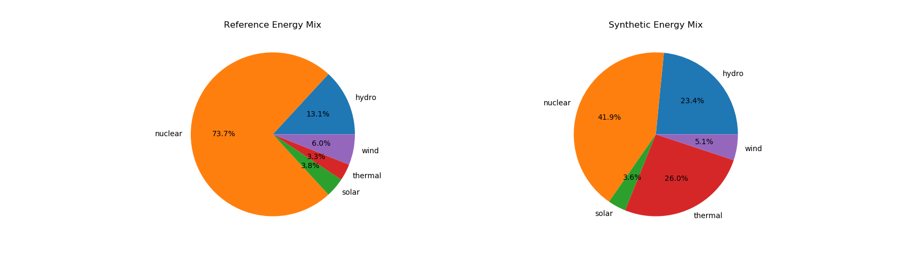
* *reference_prod_per_carrier* and *synthetic_prod_per_carrier* are HTLM interactive file in which the energy productions (MWh) of each generator
are stacked and plotted in time.
.. image:: ../pictures/Dispatch_view_example.png

Load KPIs
^^^^^^^^^^

2 indicators concerning the energy consumption are returned.

* *load_by_day_of_week* - showing the average per day of week of the aggregate energy consumption (normalized by max)
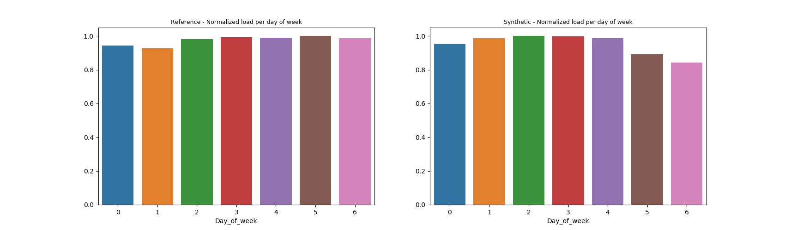
* *load_by_week_of_year* - showing the average per week of year of the aggregate energy consumption (normalized by max)
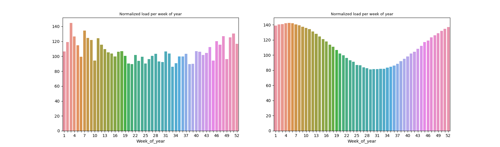

Indicators showing the correlation between thermal production and energy consumption are returned, with one matrix for each region.
An example for region 2

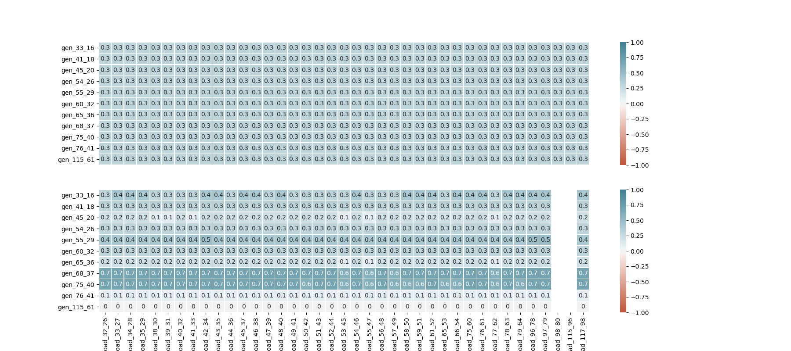

An equivalent is provided with wind production, which should be close to zero correlation in our reference scenario

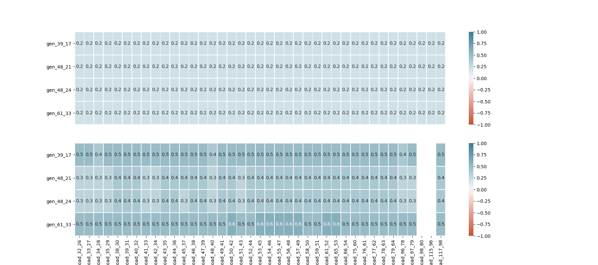

.. _solar-kpi:

Solar KPIs
^^^^^^^^^^

4 solar indicators are computed.

* *Distribution of solar production* - Histogram and density plot representing the solar energy productions (MWh) of each time step. The y-axis is given in frequency percentage
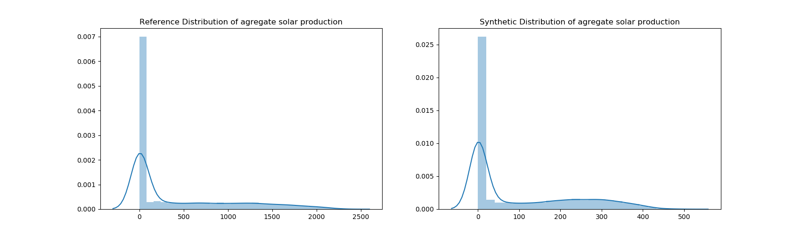
* *Solar at night* - Shows for each season the percentage of solar energy production that occurs at night (night hours in *paramsKPI.json*)
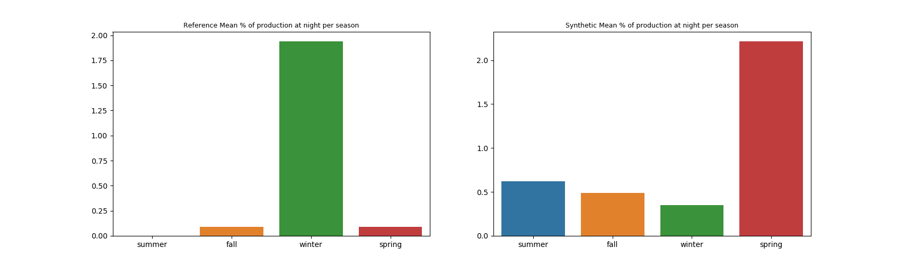
* *Cloudiness* - This indicator is an estimate of the percentage of "cloudy production days" in a given month, i.e. percentage of days in which "high" productions are below a certain level. For each month, we compute a threshold (production quantile multiplied by a certain ratio, those 2 parameters are in *paramsKPI.json*). Then we count the days whose production quantile are below this threshold in the month.
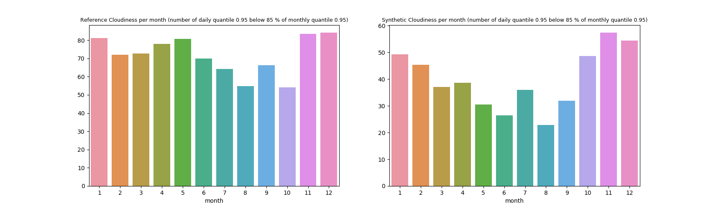
* *Solar generators correlation matrix* - Heatmap showing the Pearson correlation matrix between solar generators productions by day (night hours in *paramsKPI.json*). If the region have different climates, we should see submatrix appear
.. image:: ../pictures/solar_kpi/solar_corr_heatmap.png

Wind KPIs
^^^^^^^^^^

Several indicators are provided for wind production:

* *Distribution of wind production* - Histogram and density plot representing the wind energy productions (MWh) of each time step. The y-axis is given in frequency percentage
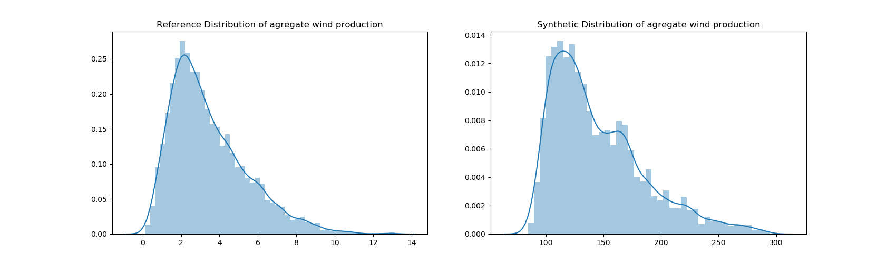
* *Monthly features on wind power distribution* - Skewness and Kurtosis of the energy production of each month
* *Wind generators correlation matrix* - Heatmap showing the Pearson correlation matrix between wind generators productions by day (night hours in *paramsKPI.json*). If the region have different climates, we should see submatrix appear
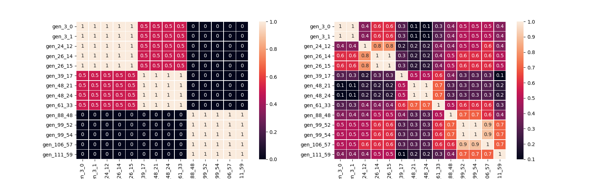
* *Auto-correlation* - For each generator (15 time step lags) and *cross-correlation plots* for each pair of generator (-10 to +10 time steps differences)
* *Power spectral density* - Frequency and power are log-scaled
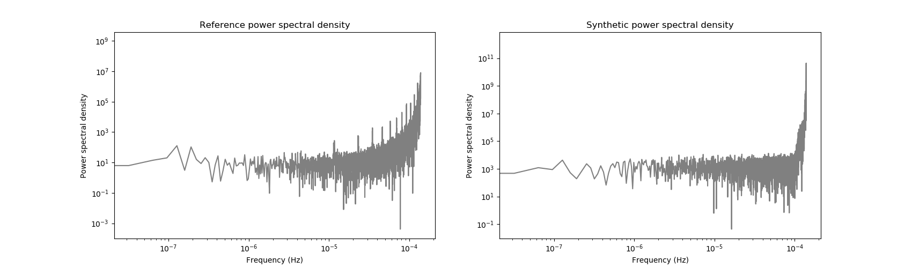

.. _hydro-thermal-kpi:

Hydro and Thermal KPIs
^^^^^^^^^^^^^^^^^^^^^^^^^^^^^^

2 categories of hydraulic and thermal energy production are available:

* *Hydro or Thermal per month* - Monthly average of the aggregate production. It is given as percentage of peak value
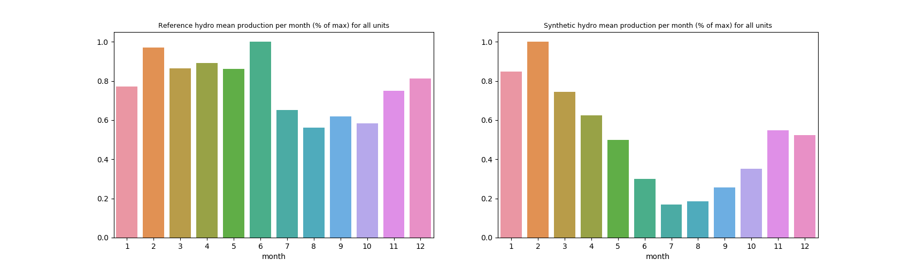
* *Low price* and *High price* - for each generator, gives the percentage of time steps where production is above (below) 0.8*Pmax (0.2*Pmax) during high (low) price period. Low and high price period are given by extreme value of price (under percentile 10 and over percentile 90). If no price chronic is provided in KPI inputs, these quantiles are applied on energy demand
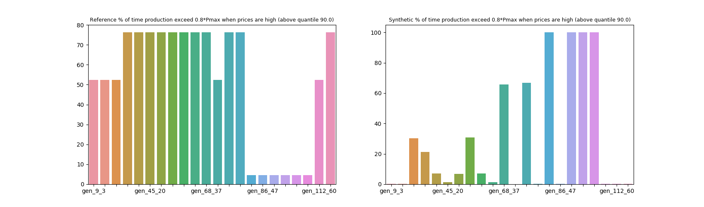

Nuclear KPIs
^^^^^^^^^^^^^

3 nuclear indicators are returned:

* *Production distribution* - Aggregate nuclear production distribution, one observation of the distribution being a time step
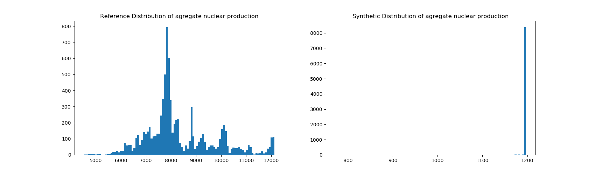
* *Lag distribution* - We compute the ramp in aggregate nuclear production between each successive time step, and plot the distribution
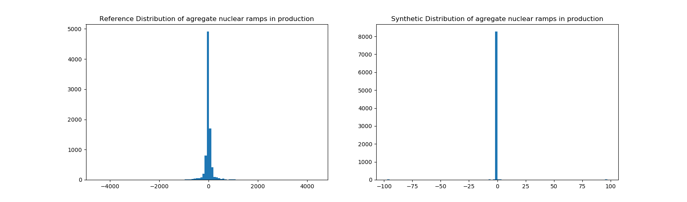
* *Maintenance* - We compute the percentage of time steps in which the aggregate nuclear production is zero
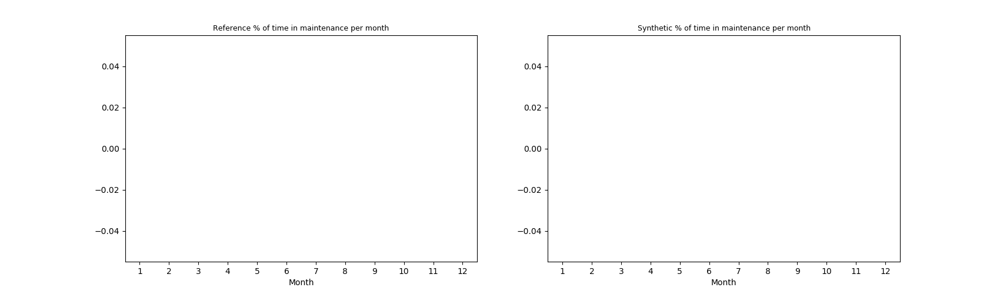

